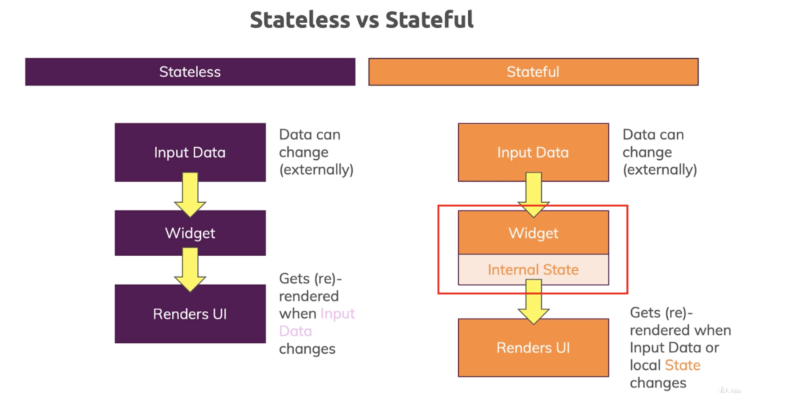

# Dart y Flutter

## Dart

Es un lenguage:
- Orientado a objetos y fuertemente tipado
- Multiproposito optimizado para desarrollo de UI
- Permite desarrollar toda la app con un solo lenguage de programacion

### Variables

1. **Late** &rarr; Declarar variables no nulas que se inicializaran mas adelante o tambien para inicializar de manera lazy
    ```dart
    late String temperature;
    late String temperature2 = readThermometer(); //Lazily Initialized
    ```
2. **Final** &rarr; Declarar variables que no cambiaran su valor
3. **Const** &rarr; Declarar varirables que no cambiaran su valor y crear valores constantes

### Null Safety

Es la solucion que provee Dart para _NullPointerException_. Por defecto Dart obliga a que todas las variables no puedan ser nulas y asi transforma un _runtime error_ en un _edit time error_.

En caso de que querramos que una variable pueda ser null, se aclara agregando un ? en el tipo de la variable `int? aNullableInt = null;`

## Flutter

* **Performance** &rarr; Es superior a los frameworks que utilizanJavascript
* **Madurez** &rarr; Su API cambia poco frecuentemente y no le faltan funcionalidades

* **Contras**:
    * No es bueno para ciertos casos de uso &rarr; juegos con requerimientos pesados en graficos
    * Aunque soporta Web, en este ambito hay otros frameworks mucho mas maduros y con mas funcionalidad
    * Agrega una capa mas de logica por lo que ciertos errores pueden ser mas dificiles de diagnosticar y solucionar

### Widgets

Son los elementos que conforman la UI, describen como se ve la app. Cuando el estado de un widget cambia, este se reconstruye y renderiza los cambios en la app.
Hay dos tipos: **Stateless** y **Statefull**.



