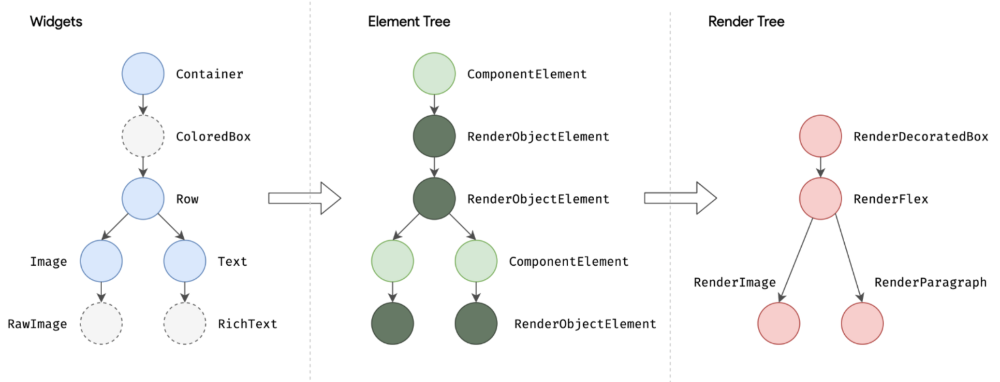

# Layout and Widgets
[Go to Index](resumen.md)

## Anatomia de una App

1. **Dart App** &rarr; Composicion de widgets para la UI y la logica de negocios. Responsabilidad del desarrollador.

2. **Framework** &rarr; Provee APIs de alto nivel para el desarrollo, y es responsable de componer el Scene a partir del Widget Tree.

3. **Engine** &rarr; Provee implementacion de bajo nivel de la API de Flutter, expone la funcionalidad usando dart:ui, se integra a cada plataforma usando la API de Embedder.

4. **Embedder** &rarr; Coordina con cada plataforma los servicios de renderizado, accesiblidad, input, etc., y expone las APIs especificas de cada plataforma.

5. **Runner** &rarr; Ejecutable para cada plataforma

## Paradigma

- Los Widgets en Flutter son objetos inmutables que forman un arbol de acuerdo a su composicion.
- Dicho arbol de widgets se reutiliza para crear otros arboles de mas bajo nivel que gestionan el _ciclo de vida_ y la _renderizacion_.
- Los widgets declaran la interfaz en funcion de un estado, y se eliminan y vuelven a crear cuando hay un cambio en el estado.

### Trees
Hay 3 tipos de trees: Widget Tree, Element Tree y Render Tree.

1. **Widget Tree** &rarr; Determina la configuracion de la app. Ante un cambio en el arbol, los widgets se reconstruyen (Dart lo hace usando su Garbage Collector).
2. **Element Tree** &rarr; Es la "instancia" real de los widgets. Gestiona el ciclo de vida y los cambios en el estado. Es conciente del contexto y la ubicacion de cada elemento.
3. **Render Tree** &rarr; Se encarga de dibujar los elementos en la pantalla determinando el tamaño y posicion de los elementos en la pantalla.

## Constraints

>Constraints go down. Sizes go up. Parent sets position.

- Un widget recibe las restricciones del padre.
- Las restricciones posibles son 4.
- El widget le pasa las restricciones a sus hijos y les pregunta que tamaño quieren tener.
- El widget posiciona a sus hijos en coordenadas x e y.
- El widget le pasa a su padre el tamaño que desea tener.

---

Limitaciones:
- Un widget solo puede definir su tamaño de acuerdo a las restricciones que recibe
- Un widget no decide su ubicacion en la pantalla, se encarga el padre.
- Para saber la ubicacion y tamaño de un widget, hay que conocer el arbol completo.

